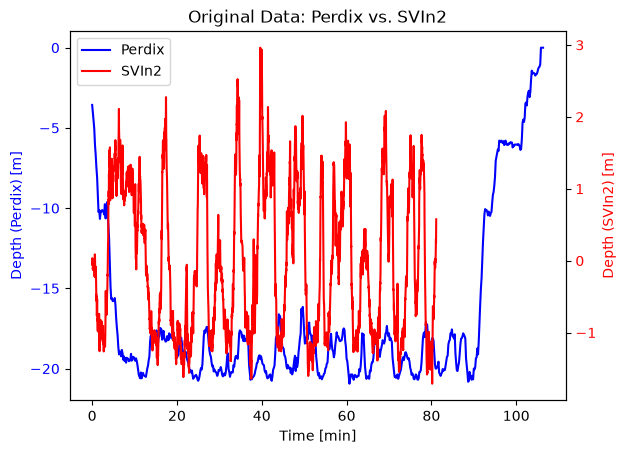
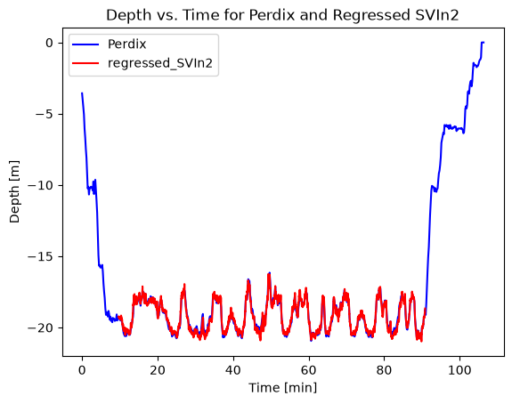

# SVIn–Perdix Matcher

Synchronizes an SVIn trajectory with a Perdix dive-computer export and calibrates
the SVIn depth measurements against the Perdix depth reference.

The script finds the time offset between the recordings, interpolates the SVIn
trajectories at the Perdix sample times, fits a linear depth correction, and
writes the corrected SVIn data and diagnostic plots to an output directory.

## Requirements

- Python 3.9 or newer
- NumPy
- pandas
- Matplotlib
- SciPy
- scikit-learn
- Open3D
## Installation

To install Python dependencies and set up the workspace, run:

```bash
mkdir ~/depth_matcher_ws
cd ~/depth_matcher_ws
git clone https://github.com/AutonomousFieldRoboticsLab/Svin-Perdix-Matcher .
sudo apt install python3-venv
python3 -m venv .venv
source .venv/bin/activate
python3 -m pip install -r requirements.txt
```

## Input files

### Perdix CSV

Use the CSV exported by the Perdix dive computer. The matcher expects the
export's metadata rows and these columns:

- `Dive Number` for elapsed time and its unit
- `GF Minimum` for depth samples
- `Start Date` and `End Date` for recording bounds

The depth unit must be supplied separately as either `m` or `ft`.

### SVIn text file

The SVIn file must be whitespace-delimited and contain:

- `#timestamp` with Unix timestamps in seconds
- `tz` with depth measurements

### Optional point cloud

If you have a `.ply` point cloud that should be shifted by the same calibrated depth offset, pass it with `--pointcloud`.

## Usage

```bash
python svin_perdix_matcher.py PERDIX_CSV SVIN_TXT OUTPUT_DIRECTORY {m,ft} [--pointcloud POINT_CLOUD.ply]
```

Example using the bundled data:

```bash
python svin_perdix_matcher.py \
  data/CatacombsPerdix.csv \
  data/svin_example.txt \
  output \
  ft \
  --pointcloud data/pointcloud_example.ply
```

This creates:

- `output/svin_example_matched.txt`
- `output/depth_offset.txt`
- `output/pointcloud_example_matched.ply` (only when `--pointcloud` is used)
- several diagnostic PNG files in `output/`

## Example outputs

| Original recordings | Time-aligned and calibrated result |
| --- | --- |
|  |  |

## Output details

The main output is the matched SVIn TXT file:

- `*_matched.txt`
- same original whitespace-delimited SVIn layout
- `tz` values are replaced with the calibrated depth values

Additional diagram outputs in `output/` include:

- `original_data.png`
- `shifted.png`
- `interpolate.png`
- `regression.png`
- `final.png`
- `depth_offset.txt` (saved calibration offset)
- `*_matched.ply` when a point cloud is passed

## Notes

- Perdix timestamps are interpreted as UTC.
- The Perdix recording must be at least as long as the SVIn recording.
- The time offset is searched at 0.1-second resolution.
- Existing output files are overwritten.
- The depth offset is stored in `depth_offset.txt` and can be reused for aligned point-cloud processing.